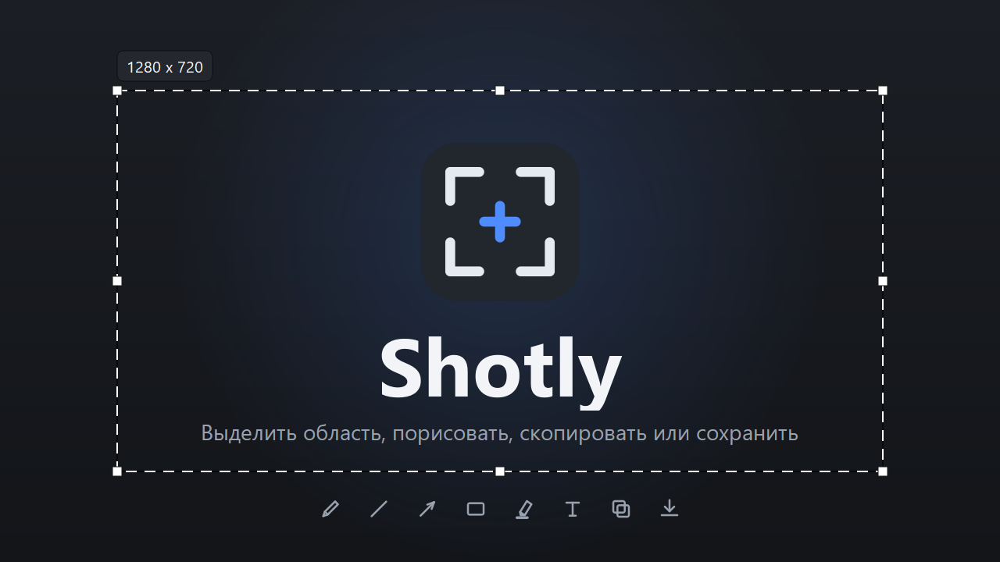

<div align="center">



# Shotly

Скриншоты как в Lightshot — выделить область, порисовать поверх, скопировать или
сохранить. Без выгрузки на сервер: всё остаётся на вашем компьютере.

</div>

## Что умеет

- **Выделение области** поверх затемнённого экрана, сразу на всех мониторах.
  Рамку можно двигать и тянуть за восемь ручек, размер видно в подписи.
- **Рисование поверх снимка**: карандаш, линия, стрелка, прямоугольник, маркер и
  текст — любым цветом из палитры (или своим из системного выбора цвета) и любой
  из четырёх толщин.
- **Копирование в буфер** и **сохранение в файл** (PNG / JPG / BMP) — по кнопке,
  горячей клавише или двойным кликом по выделению.
- **Печать** снимка через системный диалог.
- **Снимок всего экрана** отдельной горячей клавишей: сразу в файл или в буфер.
- **Имена по порядку**: `Screenshot_1`, `Screenshot_2`, … Программа занимает
  первый свободный номер в папке, поэтому удалённые снимки не оставляют дыр в
  нумерации. Шаблон настраивается.
- **Автозапуск** с Windows и **обновление из настроек** по релизам GitHub.

Программа работает из трея: левый клик по иконке — снимок, правый — меню. Съёмка
начинается только по горячей клавише или из трея: запуск программы, в том числе
при старте Windows, сам по себе оверлей не открывает. Повторный запуск ярлыка
при уже работающей программе просто ничего не делает.

## Горячие клавиши

| Где | Сочетание | Что делает |
|-----|-----------|------------|
| Глобально | `Prnt Scrn` | выделить область |
| Глобально | `Shift + Prnt Scrn` | весь экран в файл (выключено по умолчанию) |
| Глобально | `Ctrl + Prnt Scrn` | весь экран в буфер (выключено по умолчанию) |
| В оверлее | `Ctrl + C` / двойной клик | скопировать выделенное |
| В оверлее | `Ctrl + S` | сохранить выделенное |
| В оверлее | `Ctrl + P` | напечатать |
| В оверлее | `Ctrl + Z` | отменить последнюю фигуру |
| В оверлее | `Ctrl + A` | выделить весь экран |
| В оверлее | `Shift` при рисовании | ровная линия / квадрат |
| В оверлее | `Esc` | шаг назад: текст → палитра → инструмент → выход |
| В оверлее | правая кнопка | сбросить выделение, затем закрыть |

Все три глобальных сочетания меняются в настройках.

## Настройки

Открываются из меню трея, четыре вкладки:

- **Основные** — автозапуск, уведомления, память о рамке выделения, курсор в
  кадре, папка сохранения, язык (меняется сразу), сброс настроек.
- **Горячие клавиши** — три назначаемых сочетания.
- **Форматы** — PNG / JPG / BMP, качество JPEG, шаблон имени файла, спрашивать
  ли путь при каждом сохранении.
- **Обновления** — уведомления о новых версиях, проверка и установка.

## Имена файлов

Шаблон задаётся на вкладке «Форматы», под полем сразу видно пример. По умолчанию
`Screenshot_%n`.

| Код | Что подставляется |
|-----|-------------------|
| `%n` | наименьший свободный номер в папке: 1, 2, 3, … |
| `%03n` | он же с ведущими нулями: `001`, `002` |
| `%Y` `%m` `%d` | год, месяц, день |
| `%H` `%M` `%S` | часы, минуты, секунды |

Номер ищется **с единицы**, а не «последний плюс один»: если в папке есть
`Screenshot_133` и `Screenshot_135`, следующий снимок станет `Screenshot_134` и
дыра закроется. Занятым номер считается в любом из наших форматов — при
`Screenshot_7.jpg` номер 7 не достанется и файлу `.png`.

Примеры: `Screenshot_%n` → `Screenshot_140`, `%Y-%m-%d_%n` → `2026-09-02_3`,
`Shotly_%Y-%m-%d_%H-%M-%S` → `Shotly_2026-09-02_15-33-12` (без номера, как было
раньше).

## Где что лежит

| Путь | Что |
|------|-----|
| `%APPDATA%\Shotly\config.json` | настройки (создаётся при первом запуске) |
| `%APPDATA%\Shotly\crash.log` | необработанные исключения |
| `%APPDATA%\Shotly\check-*.png` | мелкий служебный кэш оформления |
| `<папка установки>\_update\` | только во время обновления |
| `~\Pictures\Shotly\` | снимки по умолчанию |

Больше программа никуда не пишет и ничего не докачивает: всё, что нужно для
работы, лежит внутри exe.

---

# Для разработчиков

## Запуск из исходников

```bash
pip install -r requirements.txt
python main.py
```

Windows, Python 3.13. Ctrl+C в консоли закрывает программу.

## Сборка

```bash
pyinstaller --clean --noconfirm Shotly.spec
```

Готовый `dist\Shotly.exe`. Установщик собирается Inno Setup 6 из
`shotly_setup.iss` — он читает версию прямо из exe, поэтому сначала соберите exe.

Версия живёт в одном месте: `APP_VERSION` в
[shotly/core/constants.py](shotly/core/constants.py). Оттуда её берут ресурс
версии в exe, установщик и проверка обновлений.

## Картинки проекта

```bash
python tools/make_assets.py
```

| Файл | Что это |
|------|---------|
| `assets/app.ico` | иконка exe, трея и установщика (7 размеров) |
| `assets/icon.png` | она же 1024x1024 — аватарка, страница релиза |
| `assets/app.png` | 256x256 для README |
| `assets/cover.png` | обложка 1280x720 для карточки программы |

## Структура

```
main.py                 точка входа: один экземпляр, Ctrl+C, применение обновления
shotly/app.py           контроллер: настройки, съёмка, окна
shotly/tray.py          иконка в трее и её меню
shotly/core/            constants, config, i18n, hotkey, capture, saver,
                        autostart, single, updater, crashlog
shotly/ui/              overlay, toolbars, colorpop, shapes, settings_window,
                        about, widgets, toast, theme, icons
tools/make_assets.py    генератор app.ico, icon.png, cover.png
```

## Автозапуск

Ключ `HKCU\Software\Microsoft\Windows\CurrentVersion\Run`, без прав
администратора. Источник истины — галочка в настройках: на каждом старте реестр
приводится к ней. Выключено — запись удаляется, включено — перезаписывается
актуальным путём к exe (после переустановки в другую папку старый путь указывал
бы в пустоту).

На первом запуске всё наоборот: конфига ещё нет, и программа берёт состояние из
реестра — иначе галочка «Запускать при старте», поставленная в мастере
установки, тут же стёрлась бы. При удалении программы запись снимается, даже
если её создала не установка, а сама программа.

В режиме разработки реестр не трогается вообще: иначе в автозапуск попал бы
`python.exe`.

## Горячие клавиши без хуков

Сочетания регистрируются системным `RegisterHotKey`: Windows сама следит за
клавишей и присылает сообщение. Хук клавиатуры не ставится, чужие нажатия через
программу не проходят и ничем не подавляются.

Раньше использовался низкоуровневый хук с подавлением — он пропускал через себя
каждое нажатие в системе и мог оставить модификатор «залипшим». Осталась только
подстраховка: если сочетание уже занято другой программой (RegisterHotKey
эксклюзивен), подключается библиотека `keyboard`, но уже без подавления.

## Как устроено обновление

Проверка идёт в фоне: первая через 8 секунд после старта, дальше раз в два часа.
Если релиз новее текущей версии и в нём есть zip с `Shotly.exe`, появляется
уведомление; клик по нему открывает настройки и сразу качает, крестик — «больше
не напоминать про эту версию».

Скачанный exe распаковывается рядом с программой и запускается с флагом
`--apply-update`: он дожидается выхода старого процесса, подменяет его собой и
стартует заново. Так заменяется работающий exe, который Windows держит
заблокированным.
